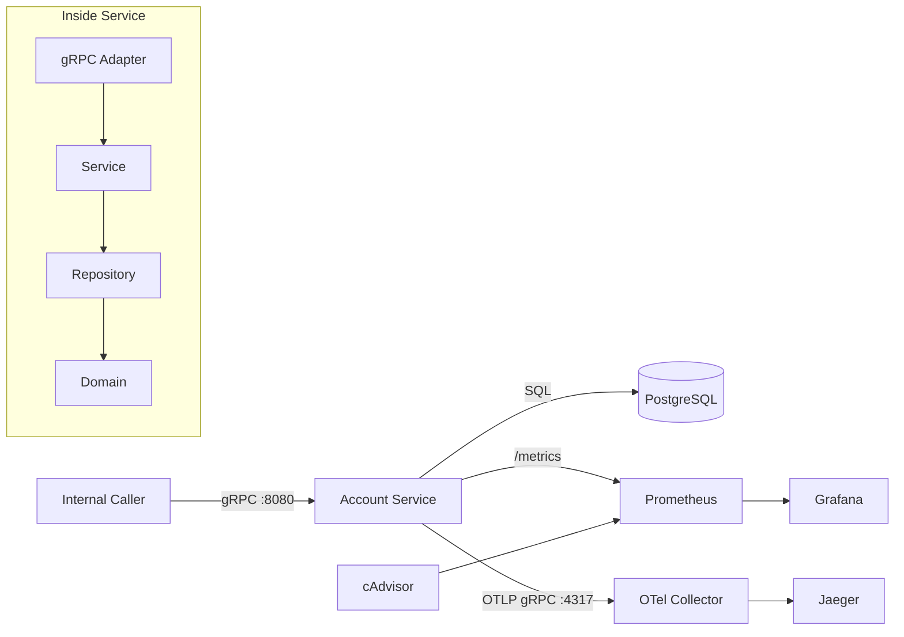

# Architecture Diagram

This diagram shows the main runtime components and integrations for the account service.

## VS Code Mermaid Checklist
- Use **Markdown: Open Preview** on this file.
- In Settings, ensure `Markdown > Mermaid: Enabled` is ON.
- If preview still fails, run `Developer: Reload Window`.

## Notes
- Business data is stored in PostgreSQL.
- App-level metrics (gRPC, DB, Go runtime/process) are scraped by Prometheus.
- Container metrics (CPU/memory) come from cAdvisor and are also scraped by Prometheus.
- Grafana visualizes Prometheus data.
- Traces are exported from the app to OTel Collector, then sent to Jaeger.
